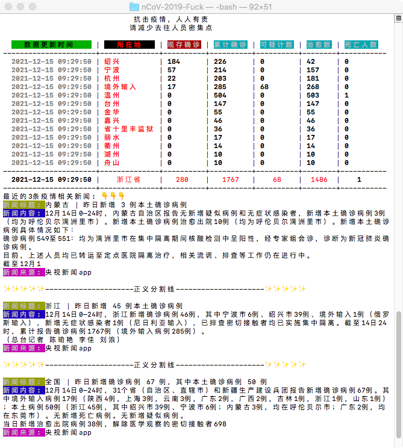
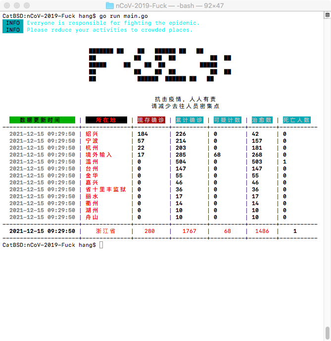
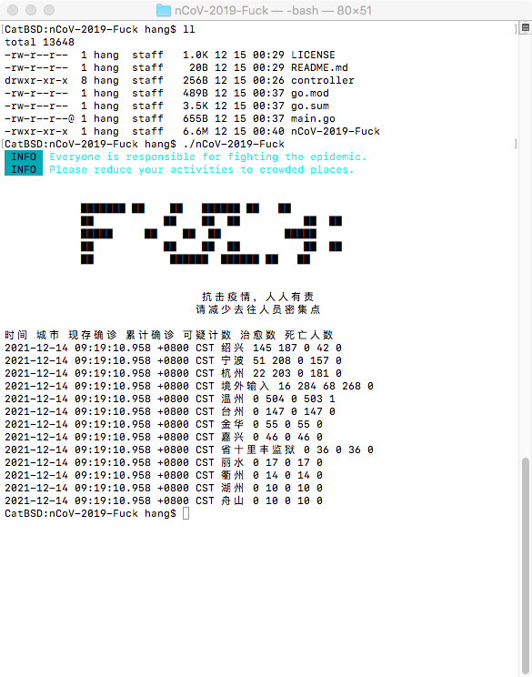

# nCoV-2019-Fuck

## v0.3

- [X] 自动定位到当前所在城市
- [X] 美化列表输出
- [X] News 展示最近3条

### Run?
```
cd nCoV-2019-Fuck/
go run main.go 

# Go版本，不确定之前版本可否运行
CatBSD:~ hang$ go version
go version go1.17.5 darwin/amd64
```
- V0.3


- V0.2


- V0.1


-----
## 致词
> 该程序献给陪伴我的 **MacBook Air 2014**

这个仓库是鄙人第一个公开的Go写的程序，关于程序里很多结构并不合理。毕竟是新手刚入门，还有很多知识掌握不牢，之后有时间会慢慢修改的。

希望大家身体健康，岁岁平安。再次，Fuck nCoV-2019

